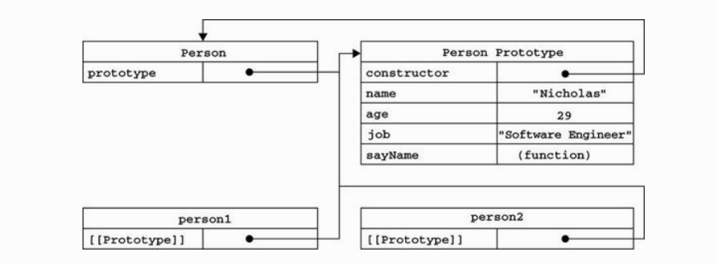
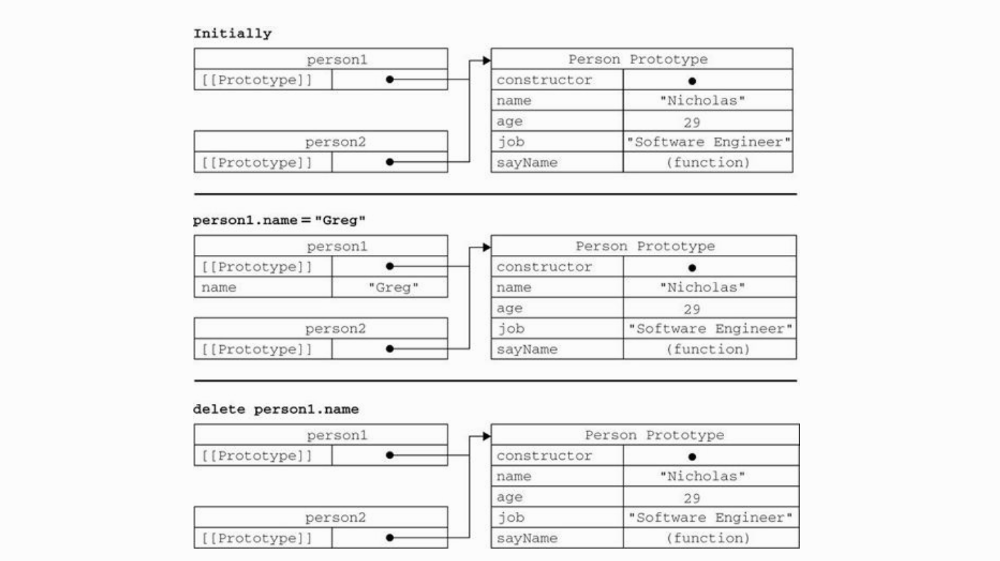
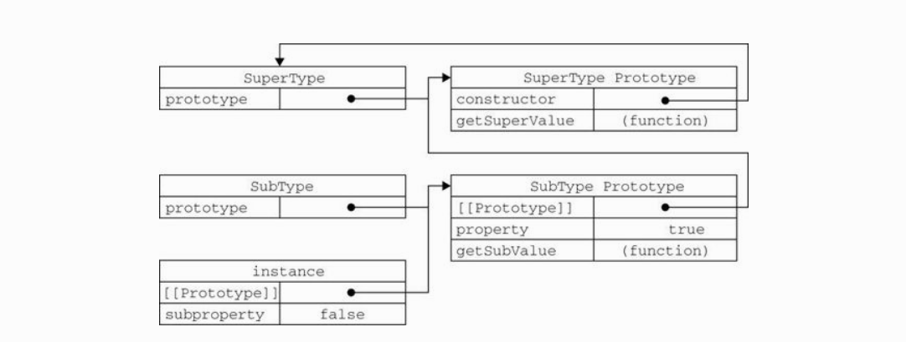

## 一、原型

### 基本概念

#### 👉prototype

每个函数生来就有的属性，无论它是否作为构造函数被调用，`prototype`指向它的原型

#### 👉**proto**

每个由构造函数创建的实例，都会携带的`__proto__`属性，指向其构造函数的原型

#### 👉constructor

每个构造函数的原型都有一个`constructor`属性，指向它的构造函数；同时和`__proto__`一样，它也是每个对象生来就有的属性

### 图解原型

下面例子中，`Person`是构造函数，`person1`、`person2`是两个实例，这是一个最简单的使用原型创建对象的方式

```js
// 空的构造函数
function Person() {}

// 将属性挂载到原型上
Person.prototype.name = 'Nicholas';
Person.prototype.age = 29;
Person.prototype.job = 'Software Engineer';

Person.prototype.sayName = function () {
  console.log('My name is ', this.name);
};

const person1 = new Person();
const person2 = new Person();

console.log(person1.sayName === person2.sayName); // true
```

由上面例子我们可以得到如下原型图（图片来自红宝书）



根据图片，我们可以得出如下结论：

- `Person.prototype`指向 Person 的原型对象

- `Person.prototype.constructor === Person`，也就是构造函数的原型对象的 constructor 指向它本身

- `person1.__proto__ === person2.__proto__ === Person.prototype`，实例和构造函数都可以访问到原型对象

- `person1.constructor === Person`，实例的`constructor`属性指向它的构造函数

⛽️**补充知识点**：

1. 实例不能改变原型中的属性值，如果实例拥有了和原型中同名属性，那么以实例自己的属性值为准；
2. 使用`hasOwnProperty`可以判断该属性是否为实例自身的属性；
3. 使用`in`判断对象中是否有该属性，无论是实例上还是原型上都会返回 true

```js
// 空的构造函数
function Person() {}

// 将属性挂载到原型上
Person.prototype.name = 'Nicholas';
Person.prototype.age = 29;
Person.prototype.job = 'Software Engineer';

Person.prototype.sayName = function () {
  console.log('My name is ', this.name);
};

const person1 = new Person();
const person2 = new Person();

person1.name = 'Greg';
console.log(person1.name); // Greg
console.log(person1.hasOwnPrototype('name')); // true
console.log(name in person1); // true

delete person1.name;
console.log(person1.name); // Nicholas
console.log(person1.hasOwnPrototype('name')); // false
console.log(name in person1); // true
```

用图片解释上面的例子


看了代码和图片还是理解不了？没关系，请往下看 👇

## 二、<span id="protoExtends">原型链</span>

### 基本概念

#### 核心

本质是重写原型对象，取而代之的是新类型的实例

<!-- 原型对象成为某个构造函数的实例，就实现了继承 -->

#### 代码实现 👩🏻‍💻

```js
function SuperFun() {
  this.supName = 'super';
}

SuperFun.prototype.getSupName = function () {
  return this.supName;
};

function SubFun() {
  this.subName = 'sub';
}

// 关键步骤：实现继承
SubFun.prototype = new SuperFun();

const instance = new SubFun();
console.log(instance.getSupName()); // super
```

从上面代码可以看到，`SubFun`的原型是`SuperFun`的实例，这样就实现了继承，通过`SubFun`创建的实例就可以获取到`SuperFun`上的属性和方法了。

### 图解原型链



### 注意事项

1. 实例的`constructor`不再指向创建它的那个构造函数，而是它的构造函数继承的那个构造函数

上例中，`instance`是`SubFun`的实例，但是`instance.constructor`指向的却是`SuperFun`，原因是`SubFun`的原型指向`SuperFun`的原型，而`SuperFun.prototype.constructor === SuperFun`

2. 在原型中存放的属性为引用数据类型时，被实例修改时，会直接将原型中的该属性值改掉

```js
function SuperFun() {
  this.supName = 'super';
  this.list = [1];
}

SuperFun.prototype.getSupName = function () {
  return this.supName;
};

function SubFun() {
  this.subName = 'sub';
}

// 关键步骤：实现继承
SubFun.prototype = new SuperFun();

const instance1 = new SubFun();
instance1.list.push(2);

const instance2 = new SubFun();
console.log(instance2.list); // [1, 2]
```

3. 不能在不影响所有对象实例的情况下，直接向被继承的那个构造函数传参，结合上面的例子，就是不能向`SuperFun`传参

## 三、继承

### 原型链继承

参照上面 👆 的[原型链](#protoExtends)的内容

### 构造函数继承

#### 核心概念

本质是使用父类的构造函数增强子类的实例，等同于复制父类的实例给子类

<!-- 如果A继承B，在A的构造函数中调用B的构造函数 -->

#### 代码实现 👩🏻‍💻

```js
function SuperFun() {
  this.list = [1];
}

function SubFun() {
  // 继承SuperFun
  SuperFun.call(this);
}

const instance1 = new SubFun();
instance1.list.push(2);

const instance2 = new SubFun();
console.log(instance2.list); // [1]
```

代码中`SubFun`使用了 call 方法，后面通过`SubFun`创建的实例，都会执行一遍`SuperFun`的构造函数，也就是说这些实例中都会有一个自己的 list 属性

#### 传递参数

借用构造函数还有一种优势，就是可以向`SuperFun`传递参数。

```js
function SuperFun(name) {
  this.name = name;
}

function SubFun(name) {
  // 继承SuperFun
  SuperFun.call(this, name);
}

const instance1 = new SubFun('instance1');
console.log(instance1.name); // instance1

const instance2 = new SubFun('instance2');
console.log(instance2.name); // instance2
```

#### 缺点

和使用构造函数创建对象一样，方法都在构造函数中定义的话，就无法被复用，每个实例都会创建一个新的方法。

### 组合继承

#### 核心概念

使用原型链实现对原型属性和方法的继承，使用构造函数实现实例属性的继承

#### 代码实现 👩🏻‍💻

```js
function SuperFun(name) {
  this.name = name
  this.list = [1]
}
SuperFun.prototype.getName() {
  console.log(this.name)
}

function SubFun(name, age) {
  SuperFun.call(this, name)
  this.age = age
}

SubFun.prototype = new SuperFun()
SubFun.prototype.getAge = function() {
  console.log(this.age)
}

const instance1 = new SubFun('instance1', 1)
instance1.list.push(2)

const instance2 = new SubFun('instance2', 2)

console.log(instance1.list) // [1,2]
console.log(instance1.getName()) // instance1
console.log(instance2.list) // [1]
console.log(instance2.getAge()) // 2
```

#### 缺点

调用了两次`SuperFun`构造函数

### 原型式继承

#### 核心概念

使用空对象作为中介，将某个对象直接赋值给空对象构造函数的原型

#### 代码实现

```js
function object(o) {
  function F() {}
  F.prototype = o;
  return new F();
}
```

从本质上讲，object 对传入的对象进行了一次浅复制

```js
const person = {
  name: 'person',
  friends: ['cat1', 'cat2'],
};

const person1 = object(person);
person1.name = 'p1';
person1.friends.push('cat3');

const person2 = object(person);
person2.name = 'p2';
person2.friends.push('cat4');

console.log(person.friends); // ['cat1', 'cat2', 'cat3', 'cat4']
```

ES6 中的`Object.create()`方法完全可以替代`object()`方法

#### 缺点

如果只是想批量创建类似的对象，使用原型式继承可以；**但是引用类型的属性始终会共享，这是使用原型模式的通病。**

### 寄生式继承

#### 核心

在原型的基础上，增强对象，返回构造函数

#### 代码实现 👩🏻‍💻

```js
function createAnother(original) {
  var clone = object(original); // 通过调用 object() 函数创建一个新对象
  clone.sayHi = function () {
    // 以某种方式来增强对象
    alert('hi');
  };
  return clone; // 返回这个对象
}
```

函数的主要作用是为构造函数新增属性和方法，以增加函数

```js
var person = {
  name: 'Nicholas',
  friends: ['Shelby', 'Court', 'Van'],
};
var anotherPerson = createAnother(person);
anotherPerson.sayHi(); //"hi"
```

#### 缺点

- 和原型式继承一样，当属性值为引用类型时，会被共享
- 无法传参

### 寄生式组合继承

本来组合继承已经很优秀了，但是由于调用了两次父类的构造函数，有可能会在子类原型上增加不必要的属性，所以出现了下面 👇 更优秀的版本。

#### 核心

使用构造函数传递参数以及解决引用类型共享问题，使用寄生模式实现原型的继承

#### 代码实现 👩🏻‍💻

```js
function inheritPrototype(subType, superType) {
  const prototype = Object.create(superType.prototype); // 创建父类原型的副本
  prototype.constructor = subType; // 修改因重写原型而改变的constructor指向
  subType.prototype = prototype; // 将新创建的对象赋值给子类的原型
}

// 父类初始化实例属性和原型属性
function SuperType(name) {
  this.name = name;
  this.list = [1];
}
SuperType.prototype.getName = function () {
  console.log('name', name);
};

// 子类调用父类的构造函数，增强子类实例属性
function SubType(name, age) {
  SuperType.call(this, name);
  this.age = age;
}

// 子类原型指向父类实例，替代了组合模式继承的subType.prototype === new SuperType()
inheritPrototype(SubType, SuperType);

SubType.getAge = function () {
  console.log(this.age);
};

const instance1 = new SubType('instance1', 12);
const instance2 = new SubType('instance2', 13);
instance1.list.push(2); // [1,2]
instance2.list.push(3); // [1,3]
```

这个和组合模式的区别，在于使用的是父类原型的副本，所以它只调用了一次父类构造函数。

### ES6 类继承

ES6 出来之前，没有类的概念，是使用原型链和构造函数实现继承；ES6 的 class 其实就是原型链+构造函数的语法糖，实现过程和寄生式组合继承一样。

```js
class Point {
  constructor(x, y) {
    this.x = x;
    this.y = y;
  }

  add() {
    return this.x + this.y;
  }
}

class ColorPoint extends Point {
  constructor(x, y, color) {
    super(x, y);
    this.color = color;
  }

  add() {
    return this.color + super.add();
  }
}

const p = new ColorPoint(1, 2, 'red');
console.log(p.add());
```

`class`中使用`extends`和`super`实现继承，比 ES5 中的继承更直观，但本质都是通过原型链和构造函数实现的。
