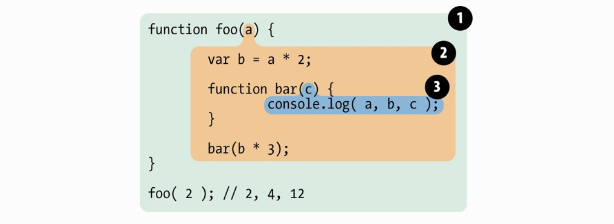

# 作用域和作用域链

## 作用域

作用域是一个独立的区域，就是在我们程序中定义变量的一个独立区域，它决定了当前代码对变量的访问权限。

### 全局作用域

在浏览器中，全局作用域就是`window`；在 Node 环境中，全局作用域就是`global`。

1. 最外层的函数和最外层的变量都拥有全局作用域；
2. 所有未被定义，直接赋值的变量，属于全局作用域，也被称为意外的全局变量；
3. `window`对象的所有变量默认在全局作用域中。

💡 弊端：如果很多代码都没有用函数包括，那么定义的变量全都在全局作用域中。这样会**造成污染全局命名空间，引起命名冲突**。

### 局部作用域

#### 函数作用域

函数作用域包含声明在函数内部的变量和函数。

```js
function foo(a) {
  var b = a * 2;

  function bar(c) {
    console.log(a, b, c);
  }

  bar(b * 3);
}

foo(2); // 2, 4, 12
```



每个泡泡都代表一个作用域：

- 第一层：全局作用域，有 foo；
- 第二层：foo 函数作用域，有 bar、a、b；
- 第三层：bar 函数作用域，有 c

#### 块级作用域

ES5 中的没有明确的块级作用域，但是`try catch`中的`catch`以及`eval`默认是块级作用域。ES6 可以通过`let`、`const`定义块级作用域。

```js
// 有块级作用域
const a = 1;

if (true) {
  const a = 2;
}

console.log(a); // 1

// 没有块级作用域
var a = 1;

if (true) {
  var a = 2;
}

console.log(a); // 2
```

##### 利用块级作用域解决的问题

指路 👉[循环变量泄漏为全局变量](#forError)

## this

### 绑定规则

#### 默认绑定

```js
// 严格模式下，this指向undefined
function foo() {
  'use strict'

  console.log(this.a)
}

foo() // TypeError: Cannot read property 'a' of undefined

--------------------------------

// 非严格模式，独立函数调用默认指向全局对象
var a = 1

function foo() {
  console.log(this.a)
}

foo() // 1

// 严格模式下不影响默认绑定
(function () {
  'use strict'
  foo() // 1
})()
```

- 独立函数运行时，this 会被默认绑定在全局作用域中
- 严格模式下，this 会绑定到`undefined`，不能默认绑定在全局作用域

#### 隐式绑定

当函数对象有上下文对象时，this 会被隐式绑定到上下文对象上，也就是我们常说的**谁调用指向谁**。

```js
function foo() {
  console.log(this.a);
}

const obj = {
  a: 2,
  foo: foo,
};

obj.foo(); // 2，此时this绑定在obj上
```

**隐式丢失**

```js
function foo() {
  console.log(this.a);
}

const obj = {
  a: 2,
  foo: foo,
};

const bar = obj.foo;
bar(); // undefined，因为此时this绑定在全局对象中，而全局对象中没有a这个变量
```

#### 显示绑定

使用`call、apply、bind`可以改变 this 指向，所以称为显示绑定。

```js
function foo() {
  console.log(this.a);
}

const obj = {
  a: 2,
};

foo.call(obj); // 2，手动绑定obj
```

指路面试题 👉[bind 的原理](#bind)

#### new 绑定

通过`new`关键字调用函数，创建对象，this 会绑定在该对象上。

```js
function Person(name) {
  this.name = name;
}

const person = new Person('huhu');
console.log(person.name); // huhu，此时this绑定在person上
```

### 优先级

> new 绑定优先级 > 显示绑定 > 隐式绑定 > 默认绑定

### 箭头函数的 this

箭头函数中 this 的指向不符合上述的规则，它是根据外层的作用域环境决定的。

```js
function foo() {
  // 返回一个箭头函数
  return (a) => {
    //this继承自foo()
    console.log(this.a);
  };
}

var obj1 = {
  a: 2,
};

var obj2 = {
  a: 3,
};

var bar = foo.call(obj1);
bar.call(obj2); // 2
```

上面对`bar`函数进行了显示修改`this`指向，但是由于`bar`是一个箭头函数，而箭头函数的`this`不能直接修改，所以它拿到的还是`obj1`的`a`值。

## 闭包

### 什么是闭包？

一句话解释，闭包就是指引用了外部作用域的变量值，并在外部作用域进行调用的函数。

```js
// 闭包的经典场景
function out() {
  const a = 1;

  function inside() {
    console.log(a);
  }

  return inside();
}

const closure = out(); // 1
```

在上面代码中，我们可以看到`inside`是一个**闭包**，它满足以下两点：

1. 可以引用外部作用域中的变量
2. 在外部作用域中被调用

（💡 延伸知识点：[IIFE 是闭包吗？](#IIFE)）

### 闭包的使用场景

#### 一、使用函数作为参数

```js
var a = 'huhu';
function foo() {
  var a = 'foo';
  function fo() {
    console.log(a);
  }
  return fo;
}

function f(p) {
  var a = 'f';
  p();
}
f(foo()); // foo
```

这里将`foo()`作为参数传给函数`f`，在`foo`里有一个闭包`fo`，它引用的是`foo`里的变量`a`，由于作用域找到了目标就会停止，不会再往上找了，于是这里的`a`输出的是`foo`。

#### 二、回调函数

```js
const a = 1;
setTimeout(() => {
  console.log(a); // 1
}, 1000);
```

使用回调函数其实就是在使用闭包，但是前提是它必须引用了外部的变量。

#### 三、节流和防抖

这是道常考的面试题指路 👉[手写节流和防抖](#throttle)

#### 四、模拟模块化

ES5 中没有私有变量和私有方法的概念，我们可以通过闭包来进行模拟。

```js
const makeCounter = function () {
  let count = 0;

  function changeCount(val) {
    count += val;
  }

  return {
    add: function () {
      changeCount(1);
    },
    subtract: function () {
      changeCount(-1);
    },
    value: function () {
      return count;
    },
  };
};

const counter1 = makeCounter();
const counter2 = makeCounter();

counter1.value(); // 0
counter1.add();
counter1.add();
counter1.add();
counter1.subtract();
counter1.value(); // 2

counter2.value(); // 0
```

我们创建了 3 个闭包，它们共享一个公共词法环境，`count`属性和`changeCount`方法在外部环境中访问不到，只能通过`makeCounter`返回的 3 个公共方法去访问。

💡 注意：不同的闭包之间具有独立性，`counter1`中的内容发生改变时，对`counter2`是没有影响的。

### 闭包的问题

> 在 JavaScript 中，每当创建一个函数，闭包就会在函数创建的同时被创建出来。 --MDN

按照 MDN 的说法，每个函数都是闭包，当我们正常的使用函数的时候，不会造成什么影响。但是如果是不正常的使用闭包时，会造成内存泄露，就是虽然变量没有被使用了，但是不能被正确回收。综合来讲，就是**不正确使用闭包会导致内存泄露**。

```js
// 正常使用闭包，不会造成内存泄露
function out() {
  const a = 1;
  function inside() {
    const b = 2;
    console.log(b);
  }

  return inside();
}
out(); // 2

// 会造成内存泄露的例子
function out() {
  const a = 1;
  function inside() {
    const b = 2;
    console.log(a);
  }

  return inside();
}
out(); // 1，inside引用了外部函数的变量，当out函数被执行完时，变量a没有被回收，造成了内存泄露
```

有的时候，我们并没有必要去使用**闭包**，如以下例子：

```js
// 定义构造函数方法时，使用了闭包
function Person(name, age) {
  this.name = name;
  this.age = age;
  this.getName = function () {
    return this.name;
  };
  this.getAge = function () {
    return this.age;
  };
}

// 使用原型添加公共方法的方式
function Person(name, age) {
  this.name = name;
  this.age = age;
}

Person.prototype.getName = function () {
  return this.name;
};

Person.prototype.getAge = function () {
  return this.age;
};
```

将公共方法定义在原型上，不需要每次创建实例都定义方法。在函数内部定义函数是不好做法，这样很容易造成没必要的闭包，而闭包在处理速度和内存消耗上比较影响性能。

## 作用域链

每个函数都有自己的执行上下文环境，当代码在这个环境中执行时，会创建变量对象的作用域链，作用域链是一个对象列表或对象链，它保证了变量对象的有序访问。

作用域链的开始是当前代码执行环境的变量对象，常被称之为“活跃对象”（AO），变量的查找会从第一个链的对象开始，如果对象中包含变量属性，那么就停止查找，如果没有就会继续向上级作用域链查找，直到找到全局对象中。

## 执行上下文、词法环境、作用域、this 之间的关系

js 是**解释型语言**，js 的执行分为解释和执行两个阶段，这两个阶段会做以下事情：

### 解释阶段（编译阶段）

- 词法分析
- 语法分析
- 作用域规则确定

### 执行阶段

- 创建执行上下文
- 执行函数
- 垃圾回收

作用域规则在解释阶段就会被确认，所以**作用域在函数定义的时候就确定了**，而不是在函数执行的时候确定的。但是，**执行上下文是在函数执行之前确定的**，这个时候**this 的指向也会被确定**。

作用域和执行上下文的区别在于：**作用域是在函数定义时就会确定，不会发生改变；而执行上下文是在函数执行时生成的，随时都可能发生改变。**

一个作用域可能有多个执行上下文（被多次调用），也可以没有执行上下文（没有被调用过）。**同一个作用域下，不同的调用可能会产生不同的执行上下文环境，从而会产生不同的变量值**。

### 总结

最后的最后，再次对这几个概念进行总结 👇：

**作用域**：作用域是一个独立的环境，用来隔离变量。内部作用域可以访问外部作用域中的变量，反之则不行。一个作用域可能有多个执行上下文。

**词法环境**：指相应代码块内标识符与变量值、函数值之间的关联关系的一种体现。具体概念可参考[词法环境](/book/js/stack)

**执行上下文**：js 代码的运行环境，分为全局执行上下文、函数执行上下文、eval 执行上下文。创建执行上下文阶段，会进行 this 绑定、创建词法环境和变量环境。

**this**：作用域和执行上下文共同决定了 this 的指向，可以将它看作是一个动态指针，会在创建执行上下文的时候确定指向。

## 🙋 面试题

### <span id="forError">一、下面代码输出什么？为什么？怎么解决？</span>

```js
for (var i = 0; i < 5; i++) {
  setTimeout(function () {
    console.log(i);
  }, 1000);
}

// 结果：1s后输出 5 5 5 5 5
```

#### 为什么会这样？

上面的代码，我们第一次看，可能会认为它是 1s 后依次输出`0、1、2、3、4`。但实际上，到最后取到的是同一个`i=5`，这里就是作用域导致的。

不知道大家发现没有，这里形成了一个**闭包**，匿名函数在全局作用域被调用，并且引用了外部变量`i`，由于全局作用域中的每次都会更新`i`的值，所以匿名函数去取的时候拿到的是最后一个值，也就是`5`。

#### 解决方法

方法 1：使用`let`定义块级作用域，保存住每个`i`值

```js
for (let i = 0; i < 5; i++) {
  setTimeout(function () {
    console.log(i);
  }, 1000);
}

// 结果：1s后输出 0 1 2 3 4
```

原理解析：我们上面分析，匿名函数拿到的是最后一个 i 值，是因为在全局作用域中，定义的是同一个变量`i`，所以 i 会被后面的值覆盖。但是由于`let`声明的是块级作用域，所以每次`for`循环都会有一个作用域，也就是这里有`5`个块级作用域，每个作用域中都有单独的`i`，这样就达到了保存住每个`i`的目的。

```js
// 进入第一个循环
{
  let i = 0

  function() {
    console.log(i) // 0
  }
}

// ...依次类推
```

方法 2：使用立即执行函数

```js
for (var i = 0; i < 5; i++) {
  (function (num) {
    setTimeout(function () {
      console.log(num);
    }, 1000);
  })(i);
}

// 结果：1s后输出 0 1 2 3 4
```

这里通过传值的方式，直接将`i`传给`setTimeout`中的匿名函数，这样就能保证每次输出的都是对应的`i`了。

### <span id="bind">二、call、apply、bind 的区别？手写 bind 方法</span>

### <span id="throttle">三、节流和防抖</span>

### 四、箭头函数为什么不能作为构造函数？箭头函数和普通函数的区别？

### <span id="IIFE">五、IIFE 是闭包吗？</span>

严格来说，IIFE 本身不算闭包，因为它不需要被调用，也就是不满足闭包在外部作用域被调用的原则。

但是，当它实现了作用域和函数的组合的时候，就形成了闭包，例如下面的代码：

```js
const c = (function () {
  let a = 1;
  return function () {
    let b = 1;
    console.log(a, b);
    a += 1;
    b += 1;
  };
})();

c(); // 1 1
c(); // 2 1
c(); // 3 1
```

这里因为外部 IIFE 函数的变量`a`一直被匿名函数引用，`a`不会被垃圾回收机制回收，所以每次都能正确加 1。而`b`是匿名函数内部的值，当函数执行完，执行上下文从执行栈中弹出后，内部变量`b`会被回收，所以每次`b`都是从 1 开始。

💡 注意：这里是借用 IIFE 形成了闭包，但是 IIFE 本身不是闭包哦！
