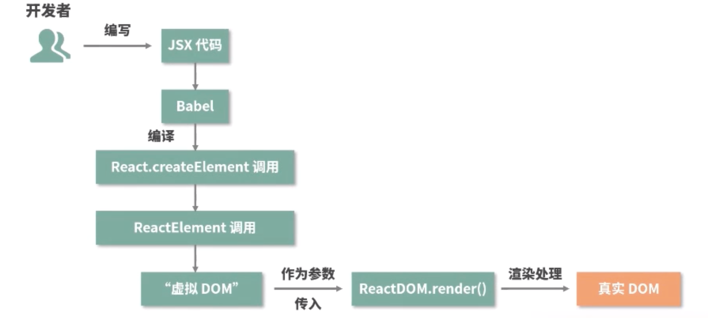

疑问 🤔️

- 虚拟 DOM 到底是个啥？
- react 为什么要用虚拟 DOM 呢？或者说虚拟 DOM 主要是做什么的呢？
- diff 算法又是什么
- 为什么一定要设置 key

看完文章提炼的问题：

1. 虚拟 DOM 提升了性能吗？
   不是的，虚拟 DOM 是提升了我们的开发效率，我们不需要去关注怎么操作 DOM。如果是首次渲染，虚拟 DOM 也许比原生 DOM 消耗更多的时间，它只是帮助我们更好地去操作原生 DOM，实现页面的更新。
2. React 通过 `$$typeof` 属性防止 XSS 攻击，主要利用的是，Symbol 值在使用 Json.stringify 时是会被忽略的，所以如果是 XSS 攻击的代码，进行转换之后，Symbol 值就不见了，React 会 `$$typeof` 属性值是否为 REACT_ELEMENT_TYPE 来判断是不是 react 元素；

# 虚拟 DOM

## JSX

JSX 其实就是语法糖，是 js 的一个扩展。内部实际是使用 React.createElement()方法创建虚拟 DOM 节点，而 React.createElement()的实际操作是对节点进行分类，做不同的操作，最后会返回一个 ReactElement 节点。最后通过 ReactDOM.render()将虚拟 DOM 变成真实的 DOM

## 什么是虚拟 DOM

### React.createElement()

### ReactElement

### ReactDOM.render()

## 调和阶段

调和阶段可中断

### 什么是调和？

调和是指虚拟 DOM 映射到真实 DOM 的过程，包括组件的挂载、更新和卸载，其中更新阶段涉及到 diff 算法的调用。

- 调和的过程是为了"使一致"，而 diff 的过程是"找不同"
- `diff`是调和过程中最重要的一个环节，所以我们在讨论调和的时候通常是在讨论`diff`

### 栈调和(Stack Reconciler)

#### 深度优先遍历

#### 同层比较

#### 固定的 key 值

### Fiber 调和(fiber Reconciler)

#### 优先级

#### 可中断的调和过程

#### diff 的方式

## 提交阶段

提交阶段不可中断，需要一次性提交
