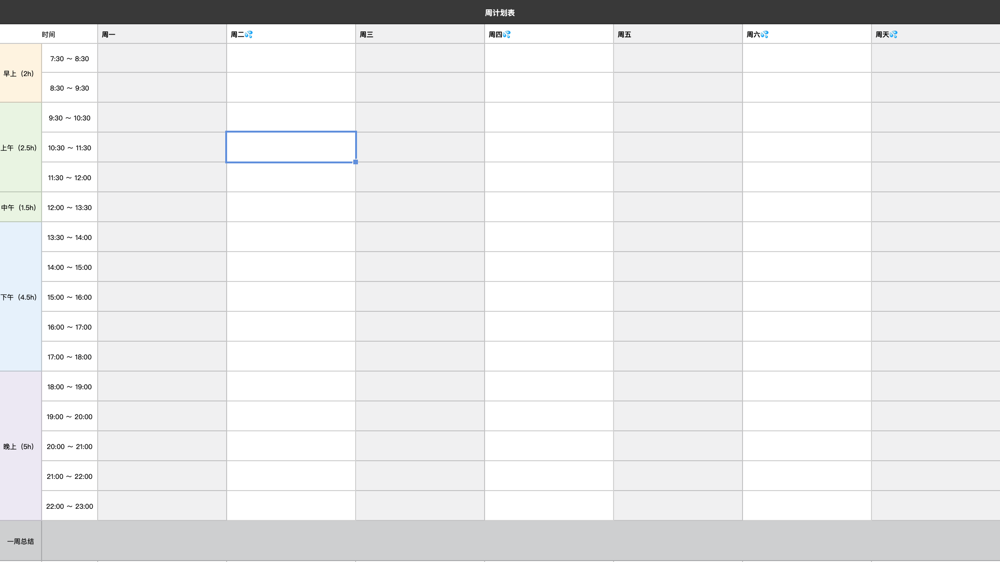

---
nav:
  title: 每日一练
  order: 2
toc: content
---

<h1>倒计时：<b style='color: red; font-size: 48px;'>98</b> 天</h1>

## 计划表

<Alert>
  人的一切痛苦，本质上都是对自己的无能的愤怒！💢

  

    <Badge>准备阶段</Badge>
    
时间：2022-10-10 ～ 2022-11-10

    
目标：对整体面试有把握

  

  

    <Badge>试水阶段</Badge>
    
时间：2022-11-10 ～ 2022-12-10

    
目标：面试通过率达80%以上

  

  

    <Badge>选择阶段</Badge>
    
时间：2022-12-10 ～ 2022-01-10

    
目标：能做出最佳的选择

  

</Alert>

### 第一周

🕙 时间：2022-10-10 ~ 2022-10-16

🎯 目标：性能优化相关的内容

🧾 打分：🌟🌟🌟✨

> 一周总结：---

### 第二周

🎯 目标：微前端相关内容

🧾 打分：🌟

| 日期             |                     Todo                     |                        备注 |
| :--------------- | :------------------------------------------: | --------------------------: |
| 6 月 20 日(周一) |         学习 ES6 中 class 的知识 8h          |  如何实现继承？重点有哪些？ |
| 6 月 21 日(周二) |   总结完 class 相关的知识 6h + 思维导图 2h   |       梳理和 ES5 继承的区别 |
| 6 月 22 日(周三) |                 手写 bind 4h                 |            每个步骤都要搞懂 |
| 6 月 23 日(周四) |       使用 ES5 实现 ES6 中的类继承 4h        |      有多余时间产出一篇文章 |
| 6 月 24 日(周五) |       搞清楚 Function 和 Object 的关系       |      理清楚原型链的头部问题 |
| 6 月 25 日(周六) |         使用 epub.js 实现在线阅读 8h         |  可能还需要增加我的书库功能 |
| 6 月 26 日(周天) | 使用 epub.js 实现在线阅读 4h + 发布小程序 4h | 还是想拥有自己的小程序呀 💪 |

> 一周总结：这周表现得 xxx
